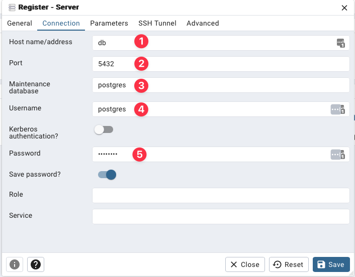
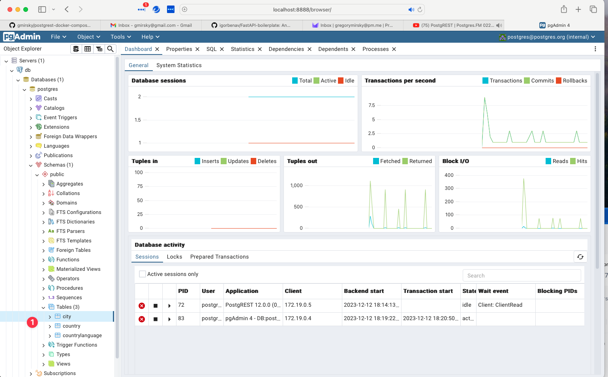
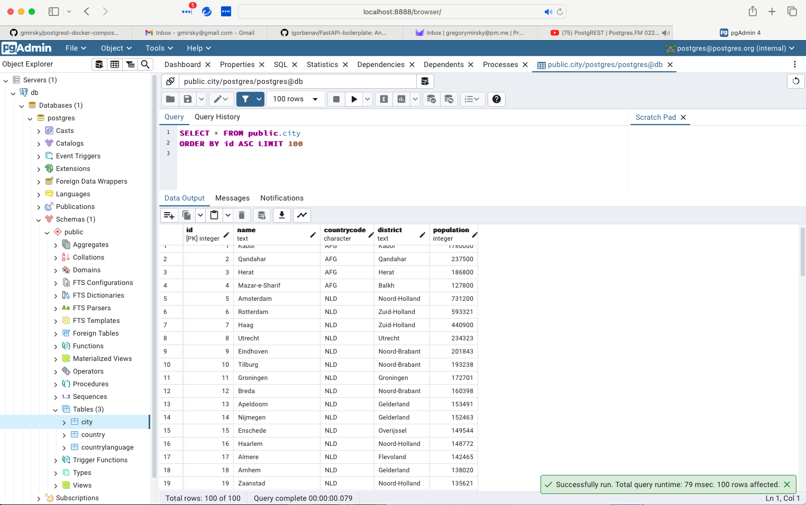

Postgres-PostgREST Example
=================

A sample Postgres, PostgREST, PGAdmin, Nginx and Swagger development environment.

## Usage

Replace the shell or SQL scripts in the the initdb folder to populate the database with your own data, if you wish or use the sample data already provided.

## Deployment

### Deploy the containers

```bash
docker-compose up -d --detach
```

### Tear down the deployment

```bash
docker-compose down --remove-orphans 
```

To remove the created Docker volumes that data is persisted to use the following command:

```bash
docker-compose down --remove-orphans --volumes
```

To remove the created Docker images and volumes that data is persisted to use the following command:

```bash
docker-compose down --remove-orphans --volumes --rmi all
```

## Demo Application

[Test out the web application that is driven by the PostgREST API calls](http://localhost) This is served from the Nginx server Postgres-demo (using port 80) in the docker-compose file to serve up a simple web application that uses the rest calls.

Now test the REST Get statements:

* [Get the cities in the database](http://localhost:3333/city)
* [Get the countries in the database](http://localhost:3333/country)
* [Get the languages in the database](http://localhost:3333/countrylanguage)
* [Get cities named Springfield from the database](http://localhost:3333/city?name=eq.Springfield)
* [Get cities with a population greater than or equal to 3,000,000](http://localhost:3333/city?population=gte.3333000)
* [Get cities tha end in "Island"](http://localhost:3333/city?district=like.*Island)
* [Get cities where the district like Island and the population is less than 1000; selecting only the city name](http://localhost:3333/city?district=like.*Island&population=lt.1000&select=id,name)

**NOTE**: All calls to port 3333 are routed through the Nginx reverse proxy. You can find the description of the reverse proxy in the `nginx` section of the `docker-compose` and `Dockerfile` scripts in the repository. 

## Swagger

 [Show the REST API endpoints for Get, Post, Delete and Patch](http://localhost:8080)

## PgAdmin

Navigate to [the PgAdmin URL](http://localhost:8888) to open up PGAdmin (you might need to give it a minute or two to be ready).

Use the values `PGADMIN_USER` and `PGADMIN_PASSWORD` in the .env file to log into PgAdmin.

Under the section `Quick Links` click on `Add New Server` to open up the database connection dialog.



1. The value should be `db`, the same name as the database service in the docker-compose script.
2. Leave as port `5432` (unless you changed the database port in the docker-compose script).
3. Use the value in `POSTGRES_DB` in the .env file.
4. Use the value in `POSTGRES_USER` in the .env file.
5. Use the value in `POSTGRES_PASSWORD` in the .env

Once successully logged into the database, you should be able to navigate the tree on the left down to tables.



1. You should see the tables `CITY`, `COUNTRY` and `COUNTRYLANGUAGE` has been created from the code in the `initdb` folder of this repository.

Right click on one of the tables and select `View/Edit Data >  First 100 Rows` you should get a result like this:



## Documentation

[PostgREST Documentation](https://postgrest.org/en/v8.0/index.html)
[Swagger Documentation](https://swagger.io/docs/)
[Postgresql Documentation](https://www.postgresql.org/docs/)
[Nginx Documentation](https://nginx.org/en/docs/)
[PGAdmin Documetation](https://www.pgadmin.org/docs/)
[PostgREST-py](https://github.com/supabase-community/postgrest-py)